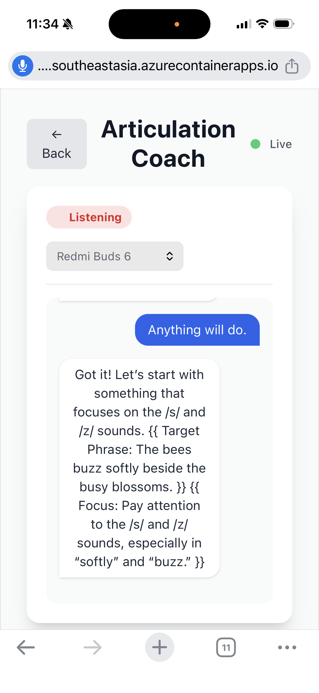
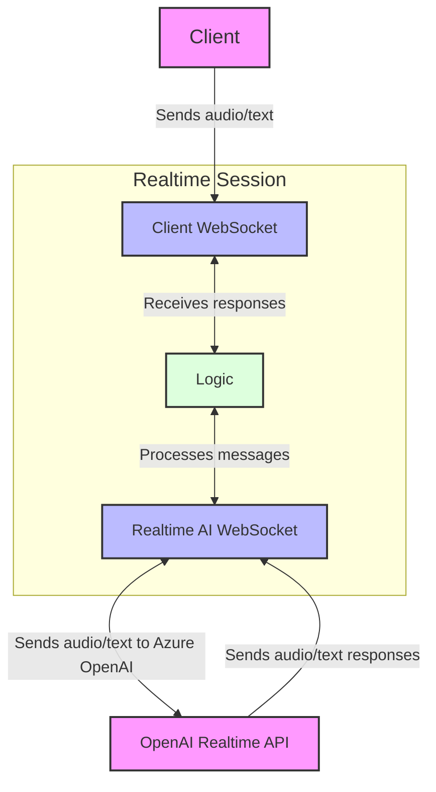

# Realtime AI App - Articulation, Architecture, and Agile Coaches

This project demonstrates how to build a real-time AI application using the Azure OpenAI Realtime API. The demo app features several specialized coaches: an Articulation Coach to help with pronunciation, a Software Architecture Coach for system design practice, and an Agile/Scrum Coach for navigating team dynamics. All coaches use real-time voice interaction for a hands-free, natural experience.

- [View Repo Adventure Walkthrough](https://azure-samples.github.io/RealtimeAIApp-JS/)

**Articulation Coach**



## Getting Started

1. Clone the project.
2. Create a `gpt-realtime` model deployment in [Azure AI Foundry](https://ai.azure.com).
3. Rename `.env.example` to `.env` in the root of the project.
4. Add your `gpt-realtime` endpoint to `OPENAI_ENDPOINT` and your key to `OPENAI_API_KEY`. You can get those values from Azure AI Foundry.

  ```
  OPENAI_API_KEY=
  OPENAI_MODEL=gpt-realtime
  OPENAI_ENDPOINT=
  OPENAI_API_VERSION=2025-04-01-preview
  BACKEND=azure
  ```

> Note: If you'd like to use OpenAI instead of Azure OpenAI, add your OpenAI API key to `OPENAI_API_KEY` and leave the `OPENAI_ENDPOINT` blank. Remove the value for `BACKEND`.

4. Run `npm install` in the `frontend` and `server` directories.
5. Run `npm run dev` in the `server` directory.
6. Run `npm run dev` in the `frontend` directory.
7. Click a coach button in the browser to get started, allow your microphone to be accessed, and start speaking.
8. Click the `Back` button to return to the selection menu.
## Keyless Approach

If you'd like to use the more secure "keyless" approach with Azure OpenAI, run the following command to add the *OpenAI Contributor* role to your user principal. Install the [Azure CLI](https://learn.microsoft.com/en-us/cli/azure/install-azure-cli) if you don't have it on your machine already.

```
az role assignment create \
  --role "Cognitive Services OpenAI Contributor" \
  --assignee-object-id "<USER_PRINCIPAL_ID>" \
  --scope "/subscriptions/<SUBSCRIPTION_ID>/resourceGroups/<RESOURCE_GROUP>" \
  --assignee-principal-type User
```

Add your *subscription ID*, *resource group*, and user *principal ID* (assigness-object-id) to the command above. 
- Run `az login` and select your target subscription.
- Get your subscription ID by running `az account list --query "[?isDefault].id" -o tsv`.
- Find your user principal ID by running `az ad signed-in-user show --query objectId -o tsv` or `az rest --method GET --url "https://graph.microsoft.com/v1.0/me" --query "id"`.

You can then remove the `OPENAI_API_KEY` value your `.env` file.


## Architecture Overview

The following diagram illustrates the WebSocket communication flow in the `RTSession` class, showing how client messages are processed and relayed to the OpenAI Realtime API.

- **Client**: This is you—the user interacting with the app via your browser. It sends audio or text inputs (like saying “Hello” or typing a question) to kick things off. It’s written using React.
-  **RealTime Session**: The Node.js code where the main action takes place – it manages the flow. It uses a client WebSocket to receive your inputs and send back responses, while a RealTime AI WebSocket connects to the OpenAI API. The logic block processes messages, ensuring everything runs smoothly between the client and the AI.
-  **OpenAI RealTime API**: This is the brains of the operation. It receives audio/text from the Realtime Session, processes it with the gpt-4o-realtime model, and sends back audio/text responses. The app supports calling OpenAI or Azure OpenAI.



## Acknowledgements

Thanks to [Steve Sanderson](https://github.com/SteveSandersonMS) for the initial inspiration for this demo.

## Getting Help

If you get stuck or have any questions about building AI apps, join:

[](https://aka.ms/foundry/discord)

If you have product feedback or errors while building visit:

[](https://aka.ms/foundry/forum)

## Deploying as ACA

### Step 1

```
# Define variables
RG_NAME="rg-hands-free"
LOCATION="southeastasia"
ENV_NAME="hands-free-env"

# 1. Create a Resource Group
az group create \
  --name $RG_NAME \
  --location $LOCATION

# 2. Create the Container Apps Environment
az containerapp env create \
  --name $ENV_NAME \
  --resource-group $RG_NAME \
  --location $LOCATION
```

### Step 2: Deploy Backend

```
# 1. Read the .env file and format it into a single line of space-separated variables
# This ignores lines starting with '#' (comments)
ENV_VARS=$(grep -v '^#' .env | xargs)

# 2. Pass the parsed string directly into the Azure CLI command
az containerapp create \
  --name hands-free-api \
  --resource-group $RG_NAME \
  --environment $ENV_NAME \
  --image owenrbee/hands-free-api:latest \
  --target-port 8080 \
  --ingress external \
  --env-vars $ENV_VARS
```

### Step 3: Deploy Frontend

```
# 4. Retrieve the auto-generated backend FQDN
API_FQDN=$(az containerapp show \
  --name hands-free-api \
  --resource-group $RG_NAME \
  --query properties.configuration.ingress.fqdn \
  --out tsv)

echo "Backend is running at: $API_FQDN"

# Note: Depending on your frontend code, you may need to prefix this with https:// or wss://
# We will assume wss:// for a realtime URL, but adjust if your app expects https://
REALTIME_URL="wss://$API_FQDN"

# 5. Deploy the frontend UX
az containerapp create \
  --name hands-free-ux \
  --resource-group $RG_NAME \
  --environment $ENV_NAME \
  --image owenrbee/hands-free-ux:latest \
  --target-port 80 \
  --ingress external \
  --env-vars REALTIME_BFF_URL="$REALTIME_URL"
```